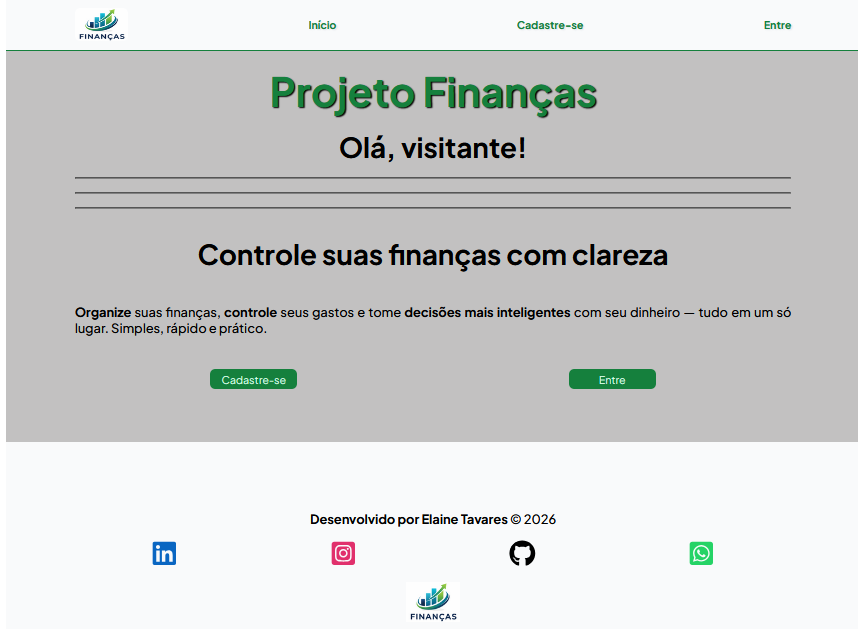
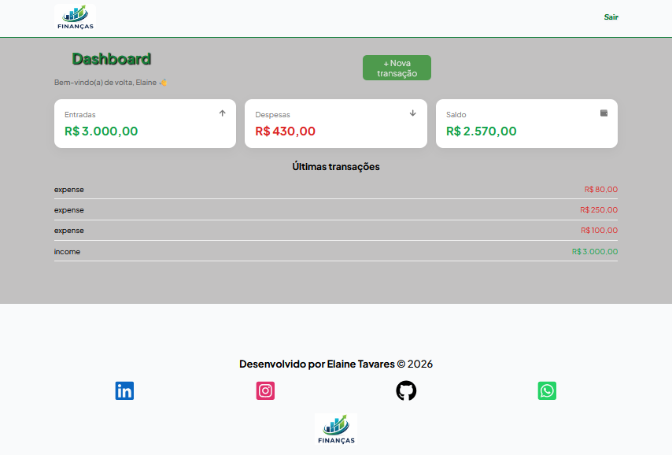

# 💰 Projeto Finanças

Aplicação web de **controle financeiro pessoal**, onde o usuário pode gerenciar suas receitas e despesas de forma simples, rápida e intuitiva.

---

## 🧠 Sobre o projeto

O **Projeto Finanças** foi desenvolvido com o objetivo de simular um sistema real de gestão financeira, permitindo que usuários acompanhem sua vida financeira no dia a dia.

A aplicação permite:

* Registrar receitas 💰
* Registrar despesas 💸
* Visualizar transações
* Editar transações
* Deletar transações
* Acompanhar saldo em tempo real
* Ter uma visão clara da saúde financeira

---

## 🚀 Funcionalidades

### 🔐 Autenticação

* Cadastro de usuário
* Login
* Controle de sessão

> 🔮 Futuro: verificação de e-mail

---

### 💸 Transações

* Cadastro de receitas e despesas
* Listagem de transações
* Exclusão de transações
* Edição de transações

---

### 📊 Dashboard

* Total de receitas
* Total de despesas
* Saldo atualizado

---

## 🧭 Fluxo do usuário

1. Usuário cria uma conta
2. Realiza login
3. Acessa o dashboard
4. Gerencia suas finanças:

   * Adiciona receitas
   * Adiciona despesas
   * Visualiza transações
   * Acompanha saldo

---

## 🛠️ Tecnologias utilizadas

### Frontend

* React
* JavaScript
* CSS Modules

### Backend

* PHP
* MySQL
* API REST

### Outros

* Axios (requisições HTTP)
* Git & GitHub

---

## 🧱 Conceitos aplicados

Este projeto demonstra conhecimentos em:

* CRUD completo
* Integração com API
* Gerenciamento de estado (React)
* Autenticação de usuários
* Organização de código e componentes
* Consumo de dados do backend
* UX/UI (feedbacks, loading, modais)

---

## 🎯 Objetivo

Este projeto foi desenvolvido com foco em:

* Evolução como desenvolvedora Front-End e também Back-End
* Simular um sistema real de mercado
* Servir como projeto de portfólio

---

## 🔮 Melhorias futuras

* ✅ Validação de formulários mais robusta
* 📧 Verificação de e-mail
* 📊 Gráficos financeiros (ex: gastos por categoria)
* 🔍 Filtros e busca de transações

---

## 📸 Preview

> 
> 

---

## 👩‍💻 Desenvolvido por

Elaine Tavares ✨

---

## 💡 Considerações finais

Este projeto representa uma evolução importante na minha jornada como desenvolvedora, consolidando conhecimentos essenciais para aplicações reais, como autenticação, consumo de API e manipulação de dados.

---
